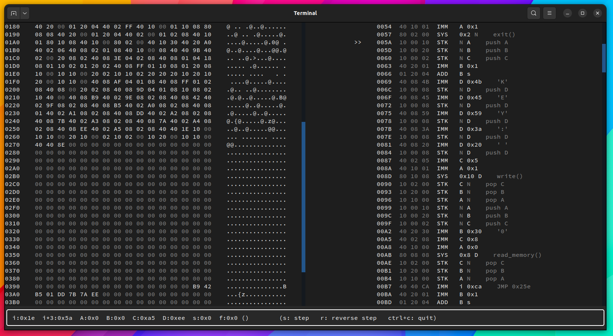

# yan85 emulator, disassembler and time-travel debugger

This is a set of tools I implemented for the reverse engineering
of yan85, the custom architecture used for vm-based obfuscation challenges in pwn.college

## Project Modules:

- `yan85.machine` A highly extensible yan85 emulator, with support for single-step execution mode
- `yan85.disassembler` Simple disassembler that extends the given yan85 emulator
- `yan85.assembler` Assembler with support for some pseudo-instructions
- `yan85.debugger` A TUI program based on the textual python library. It provides a fully scriptable time-travel debugger with a scrollable view of the program memory and code disassembly

<p align="center">

</p>

## example usage

```python

shellcode = """
:start
IMM i :label
IMM A 0x01
PUSH A
IMM A 0x02
PUSH A
:label
NOP
NOP
NOP
IMM i :start
"""

# define a yan85 machine with custom variations
class Machine_test(Machine):
    conf_vmem_bytes = 1080
    conf_code_base_address = 0
    conf_registers_base_address = 0x400
    conf_memory_base_address = 0x300
    conf_register_bytes = {
        0x0:  Register.N,
        0x10: Register.A,
        0x20: Register.B,
        0x2:  Register.C,
        0x8:  Register.D,
        0x4:  Register.s,
        0x40: Register.i,
        0x1:  Register.f,
        }
    conf_opcode_bytes = {
        0x40: Opcode.IMM,
        0x1:  Opcode.ADD,
        0x10: Opcode.STK,
        0x8:  Opcode.STM,
        0x2:  Opcode.LDM,
        0x20: Opcode.CMP,
        0x4:  Opcode.JMP,
        0x80: Opcode.SYS,
        }

machine = Machine_test()

assembler = Assembler(machine, 0)
shellcode_bytes = assembler.assemble(shellcode)
machine.load_code_bytes(shellcode_bytes)


breaks = [
    0x06,
    ]

comments = {
        0x3: "plate comment()",
        0x9: " inline top comment",
        }

debugger = Debugger(machine, breaks, comments)

```

## yan specs

```
normalized instructions:

     LSB
     |
aabbcc
__--^^
    OP
  p1
p2

op = (uint32_t) instruction & ff
p1 = (uint32_t) instruction >> 0x8 & ff
p2 = (uint32_t) instruction >> 0x10 & ff
```

## references

https://gist.github.com/fnky/458719343aabd01cfb17a3a4f7296797

https://docs.python.org/3/tutorial/modules.html#packages

