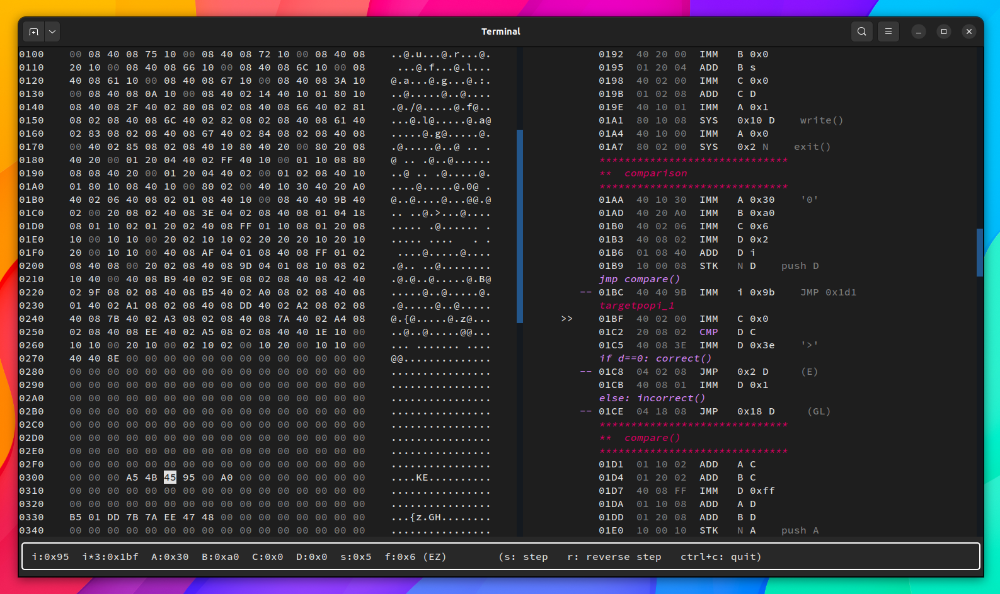

# yan85 emulator, disassembler and time-travel debugger

This is a set of tools I implemented for the reverse engineering
of yan85, the custom architecture used for vm-based obfuscation challenges in pwn.college

## Project Modules:

- `yan85.machine` A highly extensible yan85 emulator, with support for single-step execution mode
- `yan85.disassembler` Simple disassembler that extends the given yan85 emulator
- `yan85.debugger` A TUI program based on the textual python library. It provides a fully scriptable time-travel debugger with a scrollable view of the program memory and code disassembly

<p align="center">

</p>

## example usage

```python
from yan85.machine import Machine, Opcode, Register
from yan85.debugger.core import Debugger

code_dump = """
10 00 00 10 00 00 10 00 00 10 00 00 10 00 00 10 00 00
10 00 00 10 00 00 10 00 00 10 00 00 10 00 00 10 00 00
10 00 00 10 00 00 10 00 00 10 00 00 10 00 00 10 00 00
"""

machine = Machine(
        vmem_bytes = 1080,
        code_base_address = 0,
        registers_base_address = 0x400,
        memory_base_address = 0x300,
        register_bytes = {
            0x0:  Register.N,
            0x10: Register.A,
            0x20: Register.B,
            0x2:  Register.C,
            0x8:  Register.D,
            0x4:  Register.s,
            0x40: Register.i,
            0x1:  Register.f,
            },
        opcode_bytes = {
            0x40: Opcode.IMM,
            0x1:  Opcode.ADD,
            0x10: Opcode.STK,
            0x8:  Opcode.STM,
            0x2:  Opcode.LDM,
            0x20: Opcode.CMP,
            0x4:  Opcode.JMP,
            0x80: Opcode.SYS,
            }
        )

machine.load_code(code_dump)

#launch the debugger interface. ctrl-c to quit
debugger = Debugger(machine)
```

## yan specs

```
instructions

     LSB
     |
aabbcc
__--^^
    OP
  p1
p2

op = (uint32_t) instruction & ff
p1 = (uint32_t) instruction >> 0x8 & ff
p2 = (uint32_t) instruction >> 0x10 & ff
```

## references


urwid widgets
https://urwid.org/manual/widgets.html#included-widgets

https://gist.github.com/fnky/458719343aabd01cfb17a3a4f7296797

https://docs.python.org/3/tutorial/modules.html#packages

                    "0170    00 40 02 85 08 02 08 40 10 80 40 20 00 80 20 08    .@.....@..@ .. .",
                    "|| /--- 01CE  04 18 08  ??    04 24 08     JMP Invalid Register",
