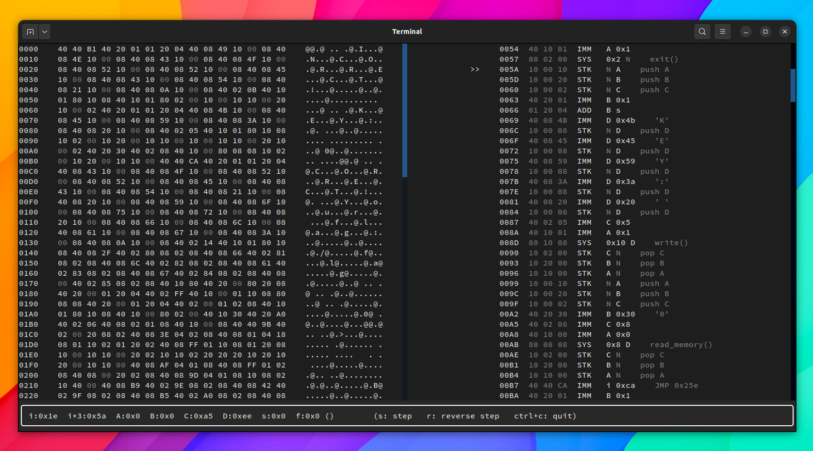

# yan85 emulator, disassembler and timeless debuggger

This project implements a Terminal user interface for the reverse engineering
of yan85 programs, the pwncollege custom architetcture.

Project Modules:

It's composed of an emulator and a Disassembler python modules, which can
be used individually in reverse engineering scripts.
A simple TUI debugger with time travel support is implemented based on those classes

<p align="center">

</p>

## example usage

```python
from yan85.machine import Machine
from yan85.utils import *

code_dump = """
08 40 08 52 10 00 08 40 08 52 10 00 08 40 08 45
08 21 10 00 08 40 08 0a 10 00 08 40 02 0b 40 10
08 45 10 00 08 40 08 59 10 00 08 40 08 3a 10 00
08 40 08 20 10 00 08 40 02 05 40 10 01 80 10 08
10 02 00 10 20 00 10 10 00 10 00 10 10 00 20 10
00 02 40 20 30 40 02 08 40 10 00 80 08 08 10 02
01 80 10 08 40 10 01 80 02 00 10 00 10 10 00 20
10 00 02 40 20 01 01 20 04 40 08 4b 10 00 08 40
08 45 10 00 08 40 08 59 10 00 08 40 08 3a 10 00
00 10 20 00 10 10 00 40 40 ca 40 20 01 01 20 04
40 08 43 10 00 08 40 08 4f 10 00 08 40 08 52 10
00 08 40 08 52 10 00 08 40 08 45 10 00 08 40 08
40 40 b1 40 20 01 01 20 04 40 08 49 10 00 08 40
08 4e 10 00 08 40 08 43 10 00 08 40 08 4f 10 00
43 10 00 08 40 08 54 10 00 08 40 08 21 10 00 08
"""

# initialze a yan85 machine
machine = Machine(
        vmem_bytes = 1024,
        code_base_address = 0,
        registers_base_address = 0x400,
        register_order = 'ABCDsif'
        )

machine.load_code(code_dump)

print_hexdump(machine.vmem)
```

## yan specs

```
instructions

     LSB
     |
aabbcc
__--^^
    OP
  p1
p2

op = (uint32_t) instruction & ff
p1 = (uint32_t) instruction >> 0x8 & ff
p2 = (uint32_t) instruction >> 0x10 & ff
```

## references

python packages:
https://docs.python.org/3/tutorial/modules.html#packages

urwid widgets
https://urwid.org/manual/widgets.html#included-widgets

                    "0170    00 40 02 85 08 02 08 40 10 80 40 20 00 80 20 08    .@.....@..@ .. .",
                    "|| /--- 01CE  04 18 08  ??    04 24 08     JMP Invalid Register",
